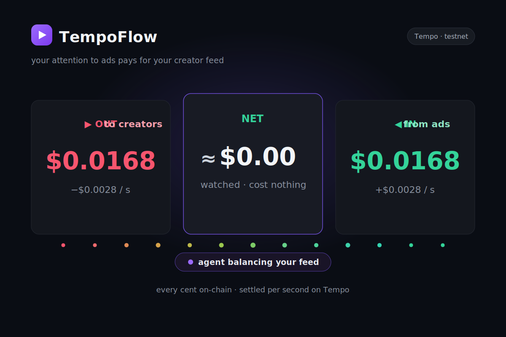

<p align="center">
  
</p>


<h1 align="center">TempoFlow</h1>

<p align="center">
  <b>A pay-per-second content feed where money flows both ways.</b><br/>
  You pay creators by the second while you watch — and when your balance runs low, your
  autonomous agent plays a matching ad that <i>pays you back</i>. Net&nbsp;≈&nbsp;€0.<br/>
  Every cent settles <b>on-chain on Tempo</b>, in real time.
</p>

<p align="center">
  <code>Tempo testnet</code> · <code>pathUSD (TIP-20)</code> · <code>verified on-chain</code> · <code>agent — no API key</code> · <b>⚠️ TESTNET ONLY</b>
</p>


---

## The idea in one line

Subscriptions are all-or-nothing and ads are ignored-and-unpaid. **TempoFlow makes both
per-second and on-chain:** you stream sub-cent payments to the exact creator you're watching,
and an autonomous agent earns it back for you from advertisers who pay for *proven* attention —
so watching is effectively free, and there's no blackbox middleman taking a hidden cut.

## Why this can only work on Tempo

Pay-per-second-of-attention means **thousands of sub-cent payments, to many recipients, settled
instantly** — a creator at €0.002/s, an advertiser paying you €0.004/s, a 70/20/10 collab split.
On Ethereum or Solana the gas on a €0.002 payment dwarfs the payment itself. Tempo's fast,
near-free **pathUSD (TIP-20)** settlement is the only substrate where this micro-payment loop is
economically real. TempoFlow leans into that: it's a **machine-payments** app — autonomous agents
streaming value per second — settled on-chain on Tempo, with an [`/openapi.json`](server/src/index.ts)
discovery document (`npx mppx discover validate`).

## Verified working — on-chain

Both money directions produce **real, mined Tempo transactions** (not mocked). From an end-to-end run:

| Flow | What happens | Result |
|---|---|---|
| **Watch** (viewer → creator) | charged per second | ✅ mined · the creator's pathUSD balance rose by the exact watched amount |
| **Ad refill** (advertiser → viewer) | paid per verified second of attention | ✅ mined |
| **Tip** (viewer → creator) | one-tap / streamed boost | ✅ mined |

Every transaction links to the **testnet block explorer** (`explore.testnet.tempo.xyz`) right in the UI.

## The autonomous ad agent — the "wow"

When your credit runs low while watching, a **deterministic agent (no LLM, no API key)** reads what
you're into (the tags of what you watch), picks the best-matching **funded** ad, plays it full-screen
to **refill your balance on-chain**, then auto-resumes your video. Pure tag-overlap + budget policy —
a real, auditable autonomous payment agent. The result is a self-financing feed: watch → balance
drains → agent tops you up with a relevant ad → repeat, netting ≈ 0 over time.

## How the money flows

| When you… | Money flows… | How |
|---|---|---|
| **Watch a creator** | **out**: you → creator, per second | Watchtime, not subscriptions — pay only while you watch, stop anytime. |
| **Run low on credit** | **in**: advertiser → you, per second | Your agent auto-plays a *matching* ad and pays you for **proven** attention. |

## More per-second-native features

Every feature is the same primitive — **stream value in tiny units, settle on-chain** — on a different surface:

| Feature | What it does |
|---|---|
| **Live on camera** | Go live from your webcam; viewers on other accounts see your real camera feed and pay you per second, while you watch a live **income meter** (watchers · combined $/s · 👏). |
| **Tip / boost** | One-tap tips or a streamed `$X/sec` boost on top of watchtime — settled on-chain. |
| **Advertiser escrow + refund** | Advertisers escrow real pathUSD on-chain to fund an ad; it pays viewers per proven second; the unspent remainder is refunded on-chain on **Stop**. |
| **Transparent glass ledger** | Every payment and the **3% platform margin** shown openly on-chain — not a hidden cut. |
| **Crowdfund goals** | Back a creator's goal; pledges are escrowed and only captured if the goal is met, else auto-refunded. |
| **Ask a creator's AI** | Chat a creator's AI persona billed **per generated token**, split to the creator. |

## Proving attention (honest about it)

"Ads pay you" only works if you can't get paid for *ignoring* the ad. Payment is gated on a
**three-layer proof** ([`server/src/attention.ts`](server/src/attention.ts)):

1. **Passive signals** — counts only while the tab is visible and the player is on-screen.
2. **Active challenge** — at random intervals you must tap a target to keep earning (eyes-on-screen).
3. **Session binding** — every heartbeat carries a per-session token; a scripted `curl` loop earns nothing.

**Demo-grade, not Sybil-proof** — Layer-1 signals are client-reported. We label this honestly rather
than overclaiming "bot-proof." See [docs/01-architecture.md](docs/01-architecture.md).

## Architecture

```
shared/  types, Tempo chain + pathUSD constants, wallet helpers
server/  Hono + node:sqlite — per-second charging, on-chain settlement, attention proof,
         the interest-matching ad agent, /openapi.json discovery
web/     Vite + React — the feed, the watch + live experience, the agent ad takeover,
         the glass ledger, on-chain receipts
agent/   headless autonomous agents (curator + advertiser) that settle on-chain
```

**Reliability note:** high-frequency per-second charges are **batch-settled on-chain** by the server
every few seconds (signing from each wallet) rather than one tx per second — so the demo stays robust
under real network conditions while every payment still lands on Tempo. See
[docs/06-decisions.md](docs/06-decisions.md).

## Run it

```bash
pnpm install
pnpm wallets:setup     # generate + fund testnet wallets, writes .env (TESTNET ONLY)
pnpm dev               # one command → server :3000 + web :5173
```

Open **http://localhost:5173**. Optional headless agents:

```bash
pnpm agent:advertiser -- --budget 0.08   # pays viewers for proven attention
pnpm agent:curator    -- --budget 0.05   # pays creators, earns from ads, net-aware
```

## For judges — evaluate in ~2 minutes

1. **Watch** any video on **Home** → the `− to creator` meter ticks up per second (real, on-chain).
2. Keep watching → your credit runs low → the **agent's matching ad takes over full-screen** and the
   `+ ad refill` meter pays you back → the video auto-resumes. That's the self-financing loop.
3. Click any **on-chain receipt** → it opens the payment on the **testnet explorer**.
4. **Studio → 🔴 Go live** (allow camera) → open the stream from a second account → you see the real
   camera feed + pay the host per second; the host sees their income meter.
5. **Ledger** → the transparent feed of every payment + the visible 3% margin.

## Docs

[00 Vision](docs/00-vision.md) · [01 Architecture](docs/01-architecture.md) ·
[02 MPP Integration](docs/02-mpp-integration.md) · [03 Agents](docs/03-agent.md) ·
[06 Decisions](docs/06-decisions.md) · [07 Demo Script](docs/07-demo-script.md) ·
[08 Pitch](docs/08-pitch.md) · [09 API](docs/09-api.md)

---

<p align="center"><b>⚠️ TESTNET ONLY — never real funds.</b> Built for the MPP Hackathon on Tempo.</p>
