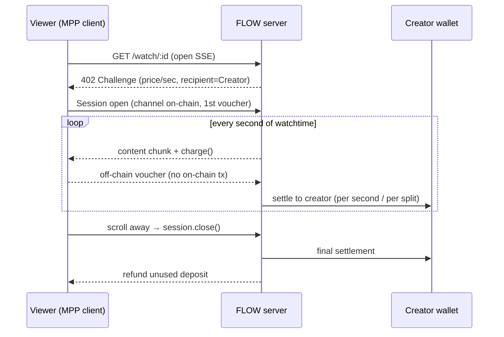
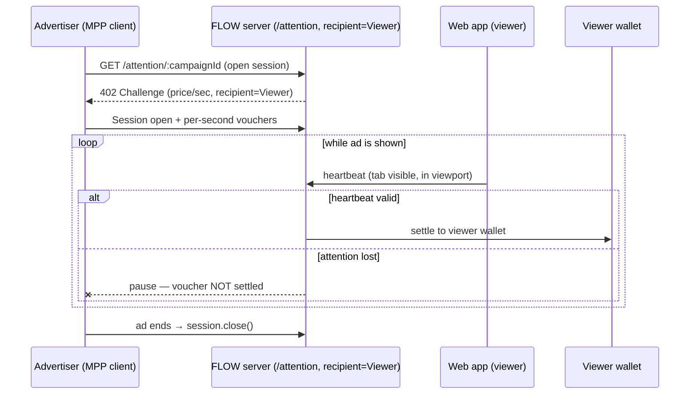

# 01 — Architecture

## Components

```
/flow
  /shared   types, currency/chain constants, wallet helpers (generate + fund)
  /server   Hono + mppx server: creator stream, attention endpoint, discovery
  /web      Vite + React viewer app: feed, heartbeats, money-flow UI, receipts
  /agent    headless TS agents: curator (pays creators/earns ads), advertiser
```

## Wallet roles (all Tempo TESTNET, ephemeral, funded at setup)

- **Viewer** — pays creators (Direction A, as MPP *client*); *receives* from advertisers
  (Direction B, as the MPP *recipient* of the attention endpoint).
- **Creator** — receives per-second watchtime payments. Collaborations split via MPP splits.
- **Advertiser** — pays viewers for proven attention (Direction B, as MPP *client*).

## The two money directions

MPP is fundamentally **"client pays server"**. FLOW uses that primitive in both
directions by swapping who is the client and who is the recipient.

### Direction A — Creator consumption (Viewer → Creator, "money out")



### Direction B — Advertising (Advertiser → Viewer, "money in", the reversal)

The **viewer sells attention as a service**; the **advertiser is the paying client**.
The FLOW server runs the attention endpoint *on the viewer's behalf*, with the
**viewer's wallet as recipient**.



## The attention-proof gate (core of the honesty thesis)

The server only accepts/settles advertiser vouchers **while valid viewer heartbeats
exist** (tab visible + ad element in viewport, optionally interaction). No heartbeat →
stream pauses → advertiser stops paying. **Nobody pays for ignored ads.** This is what
makes "ads pay you" real instead of farmable.

## Net balance & discovery

- The viewer's **net balance** rises while watching ads, falls while watching creators —
  shown live. Narrative: _attention to ads finances the creator feed_.
- `GET /openapi.json` (discovery) advertises creator streams and ad campaigns with
  `x-payment-info`, so the **agents** can find content and campaigns automatically.

## Multi-user model (YouTube/Twitch-style)

- **Users** (`server/src/users.ts`): demo people (watch + post) and companies (run ads),
  each a funded Tempo wallet, persisted to `.users.json`. Exposed via `/demo/users` (testnet
  keys) for the web **account switcher**; you pay/earn as the selected user.
- **Operator settlement (key enabler):** the server settles every channel as the channel
  **operator**, so it pays out to ANY creator/viewer wallet without holding their key. So
  `/watch/:id?as=<viewer>` pays the clip's creator wallet; `/attention/:campaignId/:viewerId`
  pays that viewer (the campaign's company is the payer). Verified on-chain.
- **Voucher-POST routing gotcha:** mppx's mid-stream voucher POST strips the URL query
  (`managementInput`), so the viewer is carried in the **path** (`/attention/:c/:viewerId`),
  not the query, to keep the recipient consistent across top-ups (06 DEV-K).
- **Content** (`content.ts`): clips owned by creators, campaigns by companies; `POST /clips`
  and `POST /campaigns` let users create. **Ledger** (`ledger.ts`) is per-address.
- **In-browser ads:** `POST /demo/run-ad` spawns the advertiser agent (separate process)
  targeting the watching viewer, gated by heartbeats — so ads pay in one browser tab.

## Persistence

In-memory state (+ `.users.json` for stable demo wallets). No heavy DB (hackathon scope).
