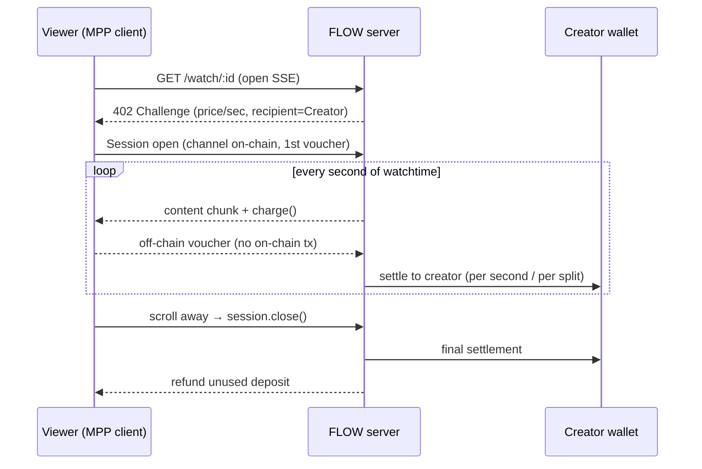
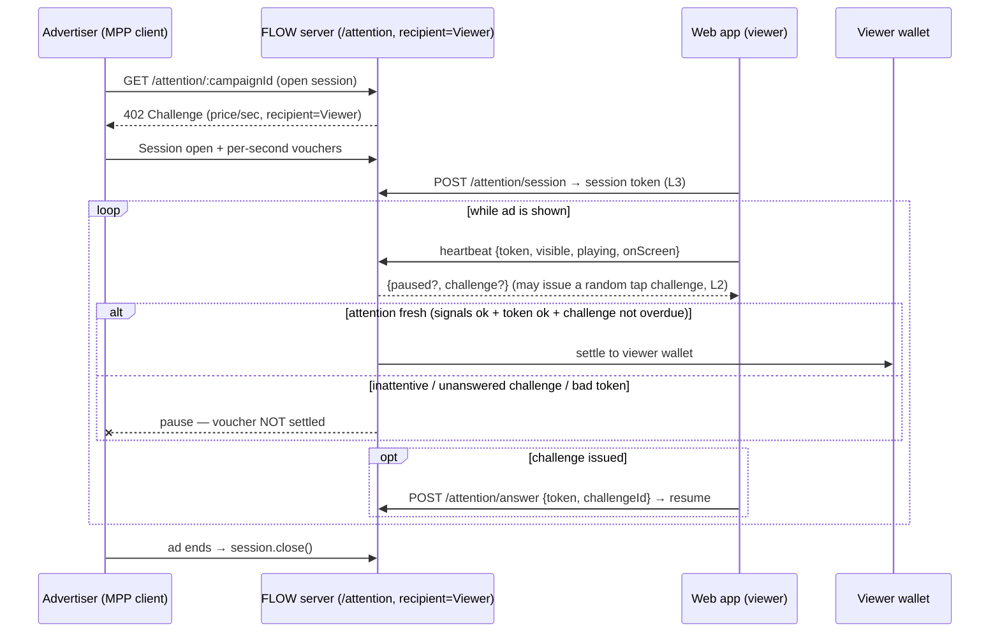

# 01 — Architecture

## Components

```
/flow
  /shared   types, currency/chain constants, wallet helpers (generate + fund)
  /server   Hono + mppx server: creator stream, attention endpoint, discovery
  /web      Vite + React viewer app: feed, heartbeats, money-flow UI, receipts
  /agent    headless TS agents: curator (pays creators/earns ads), advertiser
```

## Wallet roles (all Tempo TESTNET, ephemeral, funded at setup)

- **Viewer** — pays creators (Direction A, as MPP *client*); *receives* from advertisers
  (Direction B, as the MPP *recipient* of the attention endpoint).
- **Creator** — receives per-second watchtime payments. Collaborations split via MPP splits.
- **Advertiser** — pays viewers for proven attention (Direction B, as MPP *client*).

## The two money directions

MPP is fundamentally **"client pays server"**. FLOW uses that primitive in both
directions by swapping who is the client and who is the recipient.

### Direction A — Creator consumption (Viewer → Creator, "money out")



### Direction B — Advertising (Advertiser → Viewer, "money in", the reversal)

The **viewer sells attention as a service**; the **advertiser is the paying client**.
The FLOW server runs the attention endpoint *on the viewer's behalf*, with the
**viewer's wallet as recipient**.



## The attention-proof gate (core of the honesty thesis)

The server only accepts/settles advertiser vouchers **while the viewer's attention is
provably fresh**. "Provably" is layered, because a naive heartbeat proves only that a
timer is running — you could background the tab, mute the ad in a corner, or skip the
browser entirely and `curl` the heartbeat in a loop. The proof
([`server/src/attention.ts`](../server/src/attention.ts)) stacks three layers:

- **Layer 1 — passive signals.** Each heartbeat carries `{visible, playing, onScreen}`
  from the browser; a beat only counts while the tab is foregrounded
  (`document.visibilityState`) and the player is in the viewport (`IntersectionObserver`).
  Stops the honest background-tab / scrolled-away / manual-look-away cheats. (`playing`
  is reported but **not gated on**: the ad `<video>` only starts once payment is flowing,
  so requiring it would deadlock — and emoji-only ads have no `<video>` at all.)
- **Layer 2 — active challenge.** At random 8–16s intervals the server issues a
  `challenge` (an unpredictable token + a random on-screen `x,y`) in the heartbeat
  response. The web app renders it as a tappable target; the viewer must echo the token
  back via `POST /attention/answer` within a 6s grace window. Miss it → attention goes
  stale → payment pauses until they tap. This is what actually forces a human to be
  looking at the screen.
- **Layer 3 — session binding.** Every heartbeat must carry the per-session token from
  `POST /attention/session` (issued when the ad opens). A sessionless or stale-token beat
  mints no attention, closing the scripted-`curl` hole.

`isAttentionFresh(campaignId, viewer)` (the gate read by the `/attention` SSE loop) is
true only when the last beat that passed **all three** layers is within `HEARTBEAT_TTL_MS`
(2.5s). No fresh proof → stream pauses → advertiser stops paying. **Nobody pays for
ignored ads.** This is what makes "ads pay you" real instead of farmable.

> **Threat model:** this is demo-grade, not Sybil-proof. Layer 1 signals are
> client-reported (a determined script could forge them), and Layer 2 could be defeated
> by reimplementing the protocol. The goal is to make *casual* gaming impossible and
> *scripted* gaming expensive. Hardening would mean server-rendered challenge content
> (answer requires decoding pixels) or signed client attestation. See [ADR-010](06-decisions.md).

## Per-second-native features (same primitive, new surfaces)

Five features extend the two money directions, all reusing the same idea — *stream value
in tiny units, settle/refund trustlessly*. To stay reliable in a demo room they move money
through the **app-ledger** (`server/src/app-ledger.ts`: `appDebit`/`appCredit`, SQLite) and
record a flow in the **net ledger** (`ledger.record`, what the live receipts/pills show) —
the same path the custodial `/api/watch` and Stripe top-ups already use. See [ADR-011](06-decisions.md).

- **Live tip boost** (`POST /tip`, `server/src/index.ts`): per-second (or one-shot) tip
  Viewer → Creator, layered on the watch stream.
- **Attention auction** (`POST /auction/run`, `server/src/auction.ts`): a **second-price
  (Vickrey)** auction over funded campaigns — highest bid wins the slot, viewer earns the
  *second* price. The clearing rate is threaded into the attention session
  (`openSession(..., rewardRate)`) so the existing `/attention` SSE credits it.
- **Ask a creator's AI** (`POST /ask/:creatorId`, `server/src/ask.ts`): streams a real
  Claude answer token-by-token (`unitType: "token"`), billing the viewer per token and
  crediting the creator; falls back to a canned local stream with no `ANTHROPIC_API_KEY`.
- **Crowdfund goals** (`/goals`, `server/src/index.ts` + `goals`/`pledges` tables): pledges
  are escrowed (debited up front) and **lazily resolved** — captured to the creator once the
  target is met, or refunded to backers once the deadline passes.
- **Go live** (`/live/*`, `server/src/live.ts`): a creator starts a live clip (looping
  source); the per-second watch loop registers presence so a **shared in-memory meter**
  aggregates concurrent viewers, combined `$/sec`, total, and 👏 cheers across everyone.

## Net balance & discovery

- The viewer's **net balance** rises while watching ads, falls while watching creators —
  shown live. Narrative: _attention to ads finances the creator feed_.
- `GET /openapi.json` (discovery) advertises creator streams, ad campaigns, and the
  per-token creator-AI endpoint with `x-payment-info`, so the **agents** can find paid
  content automatically.

## Multi-user model (YouTube/Twitch-style)

- **Users** (`server/src/users.ts`): demo people (watch + post) and companies (run ads),
  each a funded Tempo wallet, persisted to `.users.json`. Exposed via `/demo/users` (testnet
  keys) for the web **account switcher**; you pay/earn as the selected user.
- **Operator settlement (key enabler):** the server settles every channel as the channel
  **operator**, so it pays out to ANY creator/viewer wallet without holding their key. So
  `/watch/:id?as=<viewer>` pays the clip's creator wallet; `/attention/:campaignId/:viewerId`
  pays that viewer (the campaign's company is the payer). Verified on-chain.
- **Voucher-POST routing gotcha:** mppx's mid-stream voucher POST strips the URL query
  (`managementInput`), so the viewer is carried in the **path** (`/attention/:c/:viewerId`),
  not the query, to keep the recipient consistent across top-ups (06 DEV-K).
- **Content** (`content.ts`): clips owned by creators, campaigns by companies; `POST /clips`
  and `POST /campaigns` let users create. **Ledger** (`ledger.ts`) is per-address.
- **In-browser ads:** `POST /demo/run-ad` spawns the advertiser agent (separate process)
  targeting the watching viewer, gated by the three-layer attention proof above — so ads
  pay in one browser tab, and only while the viewer is provably watching.

## Persistence

In-memory state (+ `.users.json` for stable demo wallets). No heavy DB (hackathon scope).
